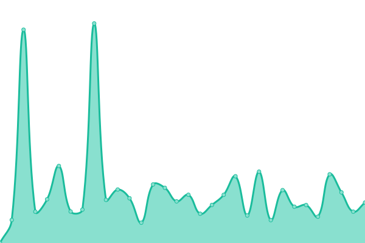
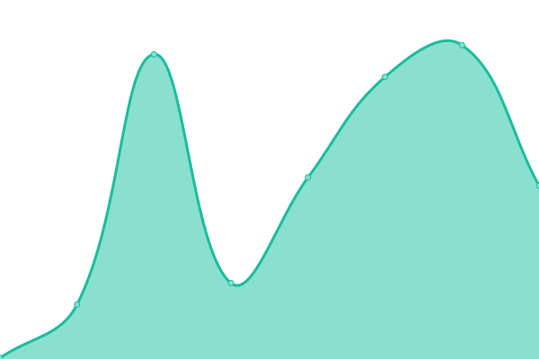
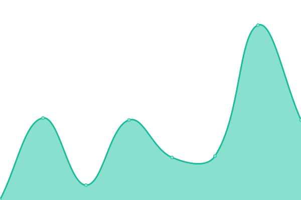
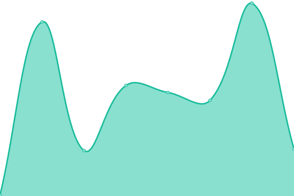

# [📈 Live Status](https://demo.upptime.js.org): <!--live status--> **🟧 Partial outage**

This repository contains the open-source uptime monitor and status page for [coffeefargo](https://demo.upptime.js.org), powered by [Upptime](https://github.com/upptime/upptime).

With [Upptime](https://upptime.js.org), you can get your own unlimited and free uptime monitor and status page, powered entirely by a GitHub repository. We use [Issues](https://github.com/coffeefargo/sitestatus/issues) as incident reports, [Actions](https://github.com/coffeefargo/sitestatus/actions) as uptime monitors, and [Pages](https://demo.upptime.js.org) for the status page.

<!--start: status pages-->
<!-- This summary is generated by Upptime (https://github.com/upptime/upptime) -->
<!-- Do not edit this manually, your changes will be overwritten -->
<!-- prettier-ignore -->
| URL | Status | History | Response Time | Uptime |
| --- | ------ | ------- | ------------- | ------ |
|  [Gstar](https://gstar.gq) | 🟩 Up | [gstar.yml](https://github.com/coffeefargo/sitestatus/commits/HEAD/history/gstar.yml) | 

 984ms
     
 | 

<a href="https://coffeefargo.github.io/sitestatus/history/gstar">100.00%</a>
    

|  [Libreddit](https://libreddit0.herokuapp.com) | 🟥 Down | [libreddit.yml](https://github.com/coffeefargo/sitestatus/commits/HEAD/history/libreddit.yml) | 

 468ms
     
 | 

<a href="https://coffeefargo.github.io/sitestatus/history/libreddit">0.00%</a>
    

|  [Quetre](https://quetre0.herokuapp.com) | 🟥 Down | [quetre.yml](https://github.com/coffeefargo/sitestatus/commits/HEAD/history/quetre.yml) | 

 482ms
     
 | 

<a href="https://coffeefargo.github.io/sitestatus/history/quetre">0.00%</a>
    

|  [Libremdb](https://libremdb0.herokuapp.com) | 🟥 Down | [libremdb.yml](https://github.com/coffeefargo/sitestatus/commits/HEAD/history/libremdb.yml) | 

 210ms
     
 | 

<a href="https://coffeefargo.github.io/sitestatus/history/libremdb">0.00%</a>
    

|  [Fosstok](https://fosstok.herokuapp.com) | 🟥 Down | [fosstok.yml](https://github.com/coffeefargo/sitestatus/commits/HEAD/history/fosstok.yml) | 

 474ms
     
 | 

<a href="https://coffeefargo.github.io/sitestatus/history/fosstok">0.00%</a>
    

|  [Lingva](https://lingva-translate-steel.vercel.app) | 🟩 Up | [lingva.yml](https://github.com/coffeefargo/sitestatus/commits/HEAD/history/lingva.yml) | 

 121ms
     
 | 

<a href="https://coffeefargo.github.io/sitestatus/history/lingva">100.00%</a>
    

<!--end: status pages-->

[**Visit our status website →**](https://demo.upptime.js.org)

## 📄 License

- Powered by: [Upptime](https://github.com/upptime/upptime)
- Code: [MIT](./LICENSE) © [coffeefargo](https://demo.upptime.js.org)
- Data in the `./history` directory: [Open Database License](https://opendatacommons.org/licenses/odbl/1-0/)
