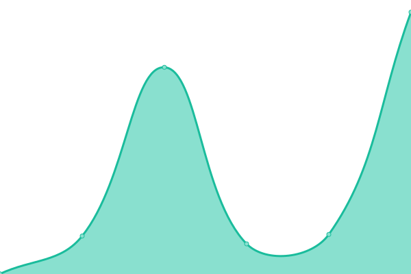

# [📈 Live Status](https://demo.upptime.js.org): <!--live status--> **🟩 All systems operational**

This repository contains the open-source uptime monitor and status page for [coffeefargo](https://demo.upptime.js.org), powered by [Upptime](https://github.com/upptime/upptime).

With [Upptime](https://upptime.js.org), you can get your own unlimited and free uptime monitor and status page, powered entirely by a GitHub repository. We use [Issues](https://github.com/coffeefargo/sitestatus/issues) as incident reports, [Actions](https://github.com/coffeefargo/sitestatus/actions) as uptime monitors, and [Pages](https://demo.upptime.js.org) for the status page.

<!--start: status pages-->
<!-- This summary is generated by Upptime (https://github.com/upptime/upptime) -->
<!-- Do not edit this manually, your changes will be overwritten -->
<!-- prettier-ignore -->
| URL | Status | History | Response Time | Uptime |
| --- | ------ | ------- | ------------- | ------ |
|  [Gstar](https://gstar.gq) | 🟩 Up | [gstar.yml](https://github.com/coffeefargo/sitestatus/commits/HEAD/history/gstar.yml) | 

 1153ms
     
 | 

<a href="https://demo.upptime.js.org/history/gstar">100.00%</a>
    

|  [A8acornu](https://a8acornu.tk) | 🟩 Up | [a8acornu.yml](https://github.com/coffeefargo/sitestatus/commits/HEAD/history/a8acornu.yml) | 

 673ms
     
 | 

<a href="https://demo.upptime.js.org/history/a8acornu">100.00%</a>
    

|  [Libreddit](https://libreddit0.herokuapp.com) | 🟩 Up | [libreddit.yml](https://github.com/coffeefargo/sitestatus/commits/HEAD/history/libreddit.yml) | 

 2385ms
     
 | 

<a href="https://demo.upptime.js.org/history/libreddit">100.00%</a>
    

|  [Quetre](https://quetre0.herokuapp.com) | 🟩 Up | [quetre.yml](https://github.com/coffeefargo/sitestatus/commits/HEAD/history/quetre.yml) | 

 1742ms
     
 | 

<a href="https://demo.upptime.js.org/history/quetre">100.00%</a>
    

|  [Libremdb](https://libremdb0.herokuapp.com) | 🟩 Up | [libremdb.yml](https://github.com/coffeefargo/sitestatus/commits/HEAD/history/libremdb.yml) | 

 1744ms
     
 | 

<a href="https://demo.upptime.js.org/history/libremdb">100.00%</a>
    

|  [Fosstok](https://fosstok.herokuapp.com) | 🟩 Up | [fosstok.yml](https://github.com/coffeefargo/sitestatus/commits/HEAD/history/fosstok.yml) | 

 576ms
     
 | 

<a href="https://demo.upptime.js.org/history/fosstok">100.00%</a>
    

<!--end: status pages-->

[**Visit our status website →**](https://demo.upptime.js.org)

## 📄 License

- Powered by: [Upptime](https://github.com/upptime/upptime)
- Code: [MIT](./LICENSE) © [coffeefargo](https://demo.upptime.js.org)
- Data in the `./history` directory: [Open Database License](https://opendatacommons.org/licenses/odbl/1-0/)
